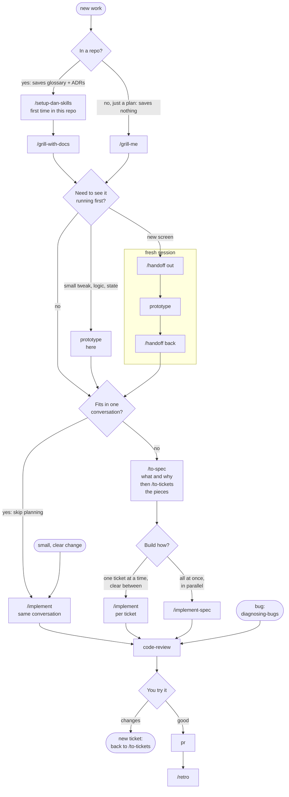

# dotfiles

[nix-darwin](https://github.com/nix-darwin/nix-darwin) +
[home-manager](https://github.com/nix-community/home-manager) setup for my
Macs: macOS settings, Homebrew, CLI tools, zsh, and a Claude Code setup (global
rules, skills, hooks). One branch serves every machine; the config is keyed by
macOS username.

## Set up a Mac

```sh
git clone https://github.com/davner/dotfiles.git
cd dotfiles
./bootstrap.sh
```

| Command | When | sudo |
| --- | --- | --- |
| `./bootstrap.sh` | Once, on a new Mac | yes |
| `./rebuild.sh` | After changing this repo | yes |
| `./rebuild.sh --build` | Check a change builds, without applying it | no |
| `./test.sh` | Before committing | no |

On a Mac without git, the clone first prompts for the Xcode Command Line Tools.

## Usernames

`flake.nix` maps each macOS username to what differs per machine (git address,
platform). `./users.sh list` prints them; `./bootstrap.sh` offers to add a
missing one.

| macOS username | Flake attribute |
| --- | --- |
| `danavner` | `#danavner` |
| `dan.avner` | `#dan-avner` |

Dots become dashes because `darwin-rebuild` splits `--flake …#attr` on `.`.

## What lives where

Files under `home/` are symlinked into `$HOME`, so editing one takes effect
with no rebuild. Adding or removing a linked file does need `./rebuild.sh`.

| Path | Holds |
| --- | --- |
| `flake.nix`, `configuration.nix`, `home.nix` | Inputs and per-user records; macOS and Homebrew; packages, zsh, and which files get linked |
| `AGENTS.md` (`CLAUDE.md` links to it) | Notes for agents working on this repo |
| `docs/adr/` | Why the Nix setup is the way it is, one decision per file |
| `home/AGENTS.md` | Global agent rules, linked to `~/.claude/CLAUDE.md`, Codex and opencode |
| `home/.claude/skills/` | The skills below, linked one by one into `~/.claude/skills/` |
| `home/.claude/*.sh`, `settings.base.json` | Hooks and status line; the settings merged into `~/.claude/settings.json` |
| `home/.config/zsh/functions.zsh` | Shell functions: `cc` (named Claude session), `cc-push` (push switch), `cc-flow` (the workflow below as a table) |

## Claude Code

### Workflow

Run `/setup-dan-skills` once in each repo. It asks four things (tracker:
Shortcut or Jira; where specs and tickets go; glossary path; ADR folder) and
saves the answers, so the other skills never ask again.

Then, for a piece of work:



1. Start with `/grill-with-docs`. It asks one round of numbered questions at a
   time, each with its recommended answer, until nothing is left open, and
   records terms in the glossary and big decisions as ADRs as it goes. Outside
   a repo, `/grill-me` runs the same interview without writing anything.
2. If a question can only be settled by running something (a state model,
   business logic, or a UI you need to see), run `prototype` for a throwaway
   answer. For a UI it briefs the screen with `impeccable`, builds a few
   variants, and waits for you to pick one. Where it runs depends on its size:
   - A small tweak to one element, or a logic or state question: right in the
     planning conversation.
   - A new screen or visual direction: in a fresh session, so the design work
     does not crowd out the context the spec still needs.
     1. `/handoff` writes a summary file; start a new session from it.
     2. Run `prototype` there and pick a variant.
     3. `/handoff` again to write the verdict, and give that file to the
        planning conversation before step 3.
3. If the build will not fit in one conversation, run `/to-spec` and then
   `/to-tickets`. The spec says where you are going: the problem, the
   solution, user stories, design and testing decisions, and what is out of
   scope. The tickets say how to get there: thin slices that each fit one fresh
   conversation and name what blocks them. Both open a page with a Copy button per
   item, and you paste them into Shortcut or Jira (the spec as the epic, the
   tickets as its stories). A conversation here means one context window, not a day of work: past roughly 150k tokens the model reasons less sharply, which is why each ticket is sized to fit a fresh one. Work that fits in one conversation skips this step; otherwise the two always go together, since a spec exists to be split into tickets.
4. Build. For tickets, either run `/implement` on one ticket at a time,
   blockers first, clearing the context between tickets, or run
   `/implement-spec` to build the whole spec in one go, with ready tickets in
   parallel on one branch. For small work, `/implement` builds it in the same
   conversation. Every path writes tests first (`tdd`) and ends with a review.
5. `code-review` checks the diff against your standards and against the spec,
   and reports the two separately. UI changes also get `/impeccable audit`.
   Then you try it yourself, and anything you want changed goes in a new
   ticket.
6. `/retro`, run in the same session before you clear it, suggests changes to
   the setup that would catch the same mistake automatically next time,
   including a stale `PRODUCT.md` or `DESIGN.md`.

A small, clear change can go straight to `/implement`, and a bug starts with
`diagnosing-bugs`. When you open a PR, `pr` writes its body.

Keep steps 1 to 3 in one conversation, and clear it only after `/to-tickets`,
so the spec and tickets build on everything the grilling settled. When a
decision is waiting on someone else, `/to-questionnaire` writes them the
questions, and their answers go into `/to-spec`. `/research` and
`/improve-codebase-architecture` produce ideas and findings that start the
flow again at `/grill-with-docs`.

### Skills

| Stage | Skill | What it does |
| --- | --- | --- |
| Setup | [`setup-dan-skills`](home/.claude/skills/setup-dan-skills/SKILL.md) | Configures a repo once: tracker and where docs go |
| Setup | [`setup-pre-commit`](home/.claude/skills/setup-pre-commit/SKILL.md) | Adds pre-commit hooks for formatting, types and tests |
| Align | [`grill-me`](home/.claude/skills/grill-me/SKILL.md) | Interviews you until a plan has no open questions |
| Align | [`grill-with-docs`](home/.claude/skills/grill-with-docs/SKILL.md) | The same, recording the glossary and ADRs as it goes |
| Align | [`grilling`](home/.claude/skills/grilling/SKILL.md) | The interview engine behind both |
| Align | [`to-questionnaire`](home/.claude/skills/to-questionnaire/SKILL.md) | Turns a decision you cannot make alone into questions for someone else |
| Design | [`prototype`](home/.claude/skills/prototype/SKILL.md) | Throwaway variants to answer "what should this look like?" |
| Design | [`domain-modeling`](home/.claude/skills/domain-modeling/SKILL.md) | Keeps the glossary and ADRs |
| Design | [`codebase-design`](home/.claude/skills/codebase-design/SKILL.md) | Vocabulary for small interfaces over deep modules |
| Design | [`improve-codebase-architecture`](home/.claude/skills/improve-codebase-architecture/SKILL.md) | Finds modules worth simplifying, as a visual report |
| Plan | [`to-spec`](home/.claude/skills/to-spec/SKILL.md) | Writes the spec, paste-ready |
| Plan | [`to-tickets`](home/.claude/skills/to-tickets/SKILL.md) | Splits it into thin tickets with their order, paste-ready |
| Build | [`implement`](home/.claude/skills/implement/SKILL.md) | Builds one ticket or a small change |
| Build | [`implement-spec`](home/.claude/skills/implement-spec/SKILL.md) | Builds a whole spec, tickets in parallel |
| Build | [`tdd`](home/.claude/skills/tdd/SKILL.md) | Test first, one slice at a time |
| Build | [`diagnosing-bugs`](home/.claude/skills/diagnosing-bugs/SKILL.md) | Reproduce, narrow down, fix, and guard a hard bug |
| Review | [`code-review`](home/.claude/skills/code-review/SKILL.md) | Standards and spec, checked separately |
| Review | [`pr`](home/.claude/skills/pr/SKILL.md) | Writes the PR title and body with the ticket ID, plus before/after screenshots to drag in, on a Copy page; you open the PR |
| Review | [`retro`](home/.claude/skills/retro/SKILL.md) | What to change in the setup after a session |
| Help | [`handoff`](home/.claude/skills/handoff/SKILL.md) | Writes a summary so a fresh session can pick up the work |
| Help | [`research`](home/.claude/skills/research/SKILL.md) | Answers a question from primary sources, saved as markdown |
| Help | [`teach`](home/.claude/skills/teach/SKILL.md) | Teaches a concept over several sessions |
| Help | [`wait-what`](home/.claude/skills/wait-what/SKILL.md) | Re-explains a message that did not land |
| Help | [`writing-for-agents`](home/.claude/skills/writing-for-agents/SKILL.md) | How to write skills and agent rules files |
| Stack | [`primereact-v10`](home/.claude/skills/primereact-v10/SKILL.md) | PrimeReact v10 reference |
| Stack | [`tailwind-v4`](home/.claude/skills/tailwind-v4/SKILL.md) | Tailwind CSS v4 reference |

`impeccable`, `shadcn`, `migrate-radix-to-base`, `chrome-devtools-axi`,
`gh-axi`, `humanizer` and `lavish` are installed by hand; see
[AGENTS.md](AGENTS.md#installing-the-skills). Third-party license notices are in
[`THIRD-PARTY-NOTICES.md`](home/.claude/skills/THIRD-PARTY-NOTICES.md).

### Hooks

| When | Script | Does |
| --- | --- | --- |
| Before every shell command | `guard-bash.sh` | Blocks risky git (`add .`, `reset --hard`, `clean -f`, `branch -D`, `checkout .`, force push, plain push unless the repo opted in with `cc-push on`), opening or merging a PR with `gh` or `gh-axi` in any repo, and commit messages that credit an AI or break the one-line shape |
| After every file write | `comment-audit.sh` | Flags code comments that tell history or refer to the session |
| Session start | `session-name.sh` | Names the session after its repo |
| Always | `statusline.sh` | Shows model, context used, and rate limits |

## Tests and CI

`./test.sh` runs everything with no sudo and no writes outside a temp folder;
`--fast` skips the Nix evaluations; `nix develop --command ./test.sh` adds the
linters. CI runs the fast suite on every push, the full suite plus a real build
every Monday, regenerates `CHANGELOG.md` on `main`, and opens a PR when flake
inputs update.

## Troubleshooting

| Message | Fix |
| --- | --- |
| `primary user 'X' does not exist` | You built another machine's config: run `./rebuild.sh` with no `--user` |
| `flake.nix has no configuration for "X"` | Run `./bootstrap.sh`, which offers to add the username |
| `home.nix: no git email for "X"` | Fill in `email` on that record in `flake.nix` |
| `Existing file '…' would be clobbered` | An older `.backup` is still there: read it, then delete it |
| `nix: command not found` during bootstrap | Open a new terminal, then re-run |
| A rebuild made things worse | `darwin-rebuild --list-generations`, then `sudo darwin-rebuild --switch-to-generation N` |

`CHANGELOG.md` is generated; to rebuild it by hand: `nix develop --command git-cliff -o CHANGELOG.md`.
