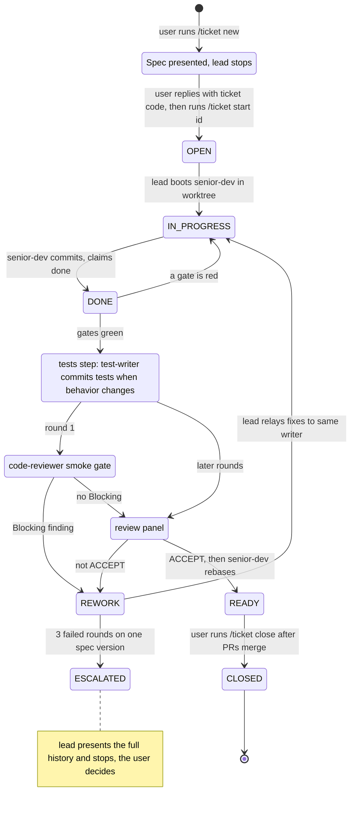

# dotfiles

[nix-darwin](https://github.com/nix-darwin/nix-darwin) +
[home-manager](https://github.com/nix-community/home-manager) configuration for
my Macs: macOS settings, Homebrew casks, CLI packages, zsh, and the dotfiles
themselves. It also carries a Claude Code agent workflow (subagents, shared
rules, hooks, and a ticket loop), written up under
[Agent workflow](#agent-workflow) for reading and borrowing from, not for
installing.

One branch serves every machine. The configuration is keyed by macOS username,
so moving between the work Mac and the personal one needs no edit.

## Commands

Clone anywhere and run bootstrap; it symlinks the checkout to `~/.dotfiles`
itself. On a Mac without git, the clone prompts to install the Xcode Command
Line Tools: accept, then clone again.

```sh
git clone https://github.com/davner/dotfiles.git
cd dotfiles
./bootstrap.sh
```

| Command | When | sudo |
| --- | --- | --- |
| `./bootstrap.sh` | Once, on a Mac that has never run this | yes |
| `./rebuild.sh` | After any change to this repo | yes |
| `./rebuild.sh --build` | To check a change builds and preview what a switch would change | no |
| `./test.sh` | Before committing | no |

`bootstrap.sh` and `rebuild.sh` build the current user's configuration; both
take `--user NAME` to build another one, and `--help`. A switch prints what it
changed as a closure diff, and `--build` prints what a switch would change.

## Usernames

`flake.nix` maps each macOS username to what differs on that machine: the git
address and the platform. `./users.sh list` prints them.

| macOS username | Flake attribute | system |
| --- | --- | --- |
| `danavner` | `#danavner` | `aarch64-darwin` |
| `dan.avner` | `#dan-avner` | `aarch64-darwin` |

On a Mac whose username is not listed, `./bootstrap.sh` offers to append it
with an empty record. Fill in the address before the first rebuild: a record
without one fails the build rather than committing from the wrong address.

Dots become dashes in the attribute name because `darwin-rebuild` splits its
`--flake …#attr` argument on `.`, so a dotted attribute can never resolve. The
scripts do the substitution.

## Layout

Files under `home/` are symlinked into `$HOME`, not copied, so editing one in
place edits this repo with no rebuild. The one exception is
`settings.base.json`, which is merged.

| Path | Lands at | Owns |
| --- | --- | --- |
| `flake.nix` | | Pinned inputs, the per-user records, one configuration per user, the dev shell |
| `configuration.nix` | | System scope: macOS defaults, Homebrew, the primary user |
| `home.nix` | | User scope: packages, zsh, starship, git, gh, and which dotfiles get linked |
| `users.sh` | | The only thing that parses the per-user records |
| `test.sh`, `cliff.toml` | | The checks under [Tests](#tests); how `CHANGELOG.md` is generated |
| `AGENTS.md` | | Notes for agents working on this repo, not the global rules |
| `home/AGENTS.md` | `~/.claude/CLAUDE.md`, `~/.codex/AGENTS.md`, `~/.config/opencode/AGENTS.md` | The global agent rules: guardrails, house rules, routing, git |
| `home/.claude/agents/` | `~/.claude/agents/` | The subagents, one file each |
| `home/.claude/commands/` | `~/.claude/commands/` | The slash commands |
| `home/.claude/skills/<name>/` | `~/.claude/skills/<name>/`, one link per skill | The skills this repo writes |
| `home/.claude/*.sh` | `~/.claude/*.sh`, one link per script | Hooks, status line, session naming, the context audit |
| `home/.claude/settings.base.json` | merged into `~/.claude/settings.json` | Hook registrations, status line, two flags |
| `home/.config/yt-dlp/` | `~/.config/yt-dlp/` | YouTube download aliases and a tone helper, with its own README |

Skills link one at a time because `~/.claude/skills/` also holds third-party
skills installed by hand, which a directory link would hide. `test.sh` reads
those `home.nix` lines to check the links.

## Agent workflow

Claude Code can hand work to subagents, each with its own prompt and tool list.
This repo defines a team of them and one set of rules they all follow. One
agent writes the code and another, which cannot edit it, judges it. Nothing is
done until a reviewer scores it 90 or more out of 100, and every claim in a
report has to be checked in the session that makes it. The rules are plain
markdown; shell hooks enforce the ones a prompt alone does not hold.

One session, the lead, conducts every agent. It is the Claude Code session the
user talks to: it spawns each subagent, reads its report, and decides what goes
to whom next. Agents do not hand work to each other: when a reviewer's findings
or a `researcher` answer reach the writer, the lead relayed them.

`home/AGENTS.md` is linked to `~/.claude/CLAUDE.md`, which Claude Code loads
into every session and every custom subagent, so no agent file repeats the
rules. The built-in `Explore` and `Plan` agents do not see it, and the rules
say to treat their output as leads to check.

### Routing by size

From [How much of the chain to run](home/AGENTS.md#how-much-of-the-chain-to-run).
When it is unclear which applies, it is a ticket.

| Change | Who does it | Gate |
| --- | --- | --- |
| One-line fix, typo, rename, config value | The lead, directly | None |
| Small: under ~50 hand-written lines, touching no schema, money, permissions or unregenerable data | `senior-dev`, in the main tree | One `code-reviewer` pass at 90. REQUEST CHANGES gets one fix and one re-score; a second REQUEST CHANGES escalates to a ticket |
| Everything else that produces code | `/ticket` | The ticket loop's review rounds, with `architect` first when the design is open |
| Schema, money, permissions, or unregenerable data | `/ticket` | As above, plus `migration-safety` |

### Hooks

A script in `~/.claude/` runs only once `settings.json` names it, and
`settings.base.json` is where these are named. Hooks fire inside subagents too,
which is where most code is written.

| Event | Runs | Effect |
| --- | --- | --- |
| `PreToolUse` on `Bash` | `guard-bash.sh` | Blocks the command (exit 2) and tells the model why: `git add` with `.`, `-A`, `--all` or `:/`; a force push; `git clean -x`; a commit message that credits an AI, has a subject over 72 characters, a body over 3 lines or over 2 bullets, or a line about the session rather than the code |
| `PostToolUse` on `Write`, `Edit`, `MultiEdit` | `comment-audit.sh` | Nudges after the write (exit 2 cannot undo it). In code files only, flags comments that tell history ("used to", "previously", dates), refer to the session ("as requested", "per the review"), or run past 2 lines |
| `SessionStart` | `session-name.sh --hook` | Names the session after its repo |
| `statusLine` | `statusline.sh` | Shows the model, context used, and rate-limit use |

The two tool hooks have a 5-second timeout. The `comment-audit.sh` entry keeps
a `[ ! -x <script> ] ||` guard, so a missing script is skipped quietly.
`guard-bash.sh` deliberately has none: if it goes missing, every Bash call
shows a hook error, so losing the guard is visible.

### The `/ticket` loop

[`ticket.md`](home/.claude/commands/ticket.md) is the loop for anything bigger
than a small change. It never pushes, merges, or deletes a branch; the finished
branch is what it hands over. `/ticket new <task>` writes the spec, presents
it, and stops. The user files it in Shortcut and replies with the ticket code,
which is the approval, then runs `/ticket start <id>`.

| Step | Run by | Uses | Commits to the ticket branch |
| --- | --- | --- | --- |
| `new`: write the spec | User, then the lead | `draft-ticket` skill; `researcher` or `architect` when the design is open | Nothing; no branch yet |
| `start`: build | User, then the lead | `senior-dev`, booted on `opus` in a worktree under `.tickets/<id>/tree/`, staying resident across rework | `senior-dev`, as it goes |
| Before review | The lead | `impeccable` skill for design options on a reader-visible change; `test-writer` when behavior changes | `test-writer`, its tests |
| Review round | The lead | `code-reviewer` every round; `migration-safety` for a migration; `ui-verifier` for frontend; `debugger` and `docs-writer` on their own triggers | `debugger` and `docs-writer`, when they run |
| Rework | The lead relays findings | The same resident `senior-dev` | `senior-dev`, each fix |
| Handover | The lead | `senior-dev` rebases in its worktree; `ship-pack` once every ticket in the batch is READY | None; folding commits into one waits for the user's word |

Inside the loop every writing agent commits its own work
([Git workflow](home/AGENTS.md#git-workflow)); outside it, committing is the
user's call. The review round has no comment reviewer, because the
`comment-audit.sh` hook already checks the writer's edits.

Upper-case names are statuses in the ticket file; the others are steps. The
writer owns IN_PROGRESS to DONE, and the lead owns every other transition.



The gates are the repo's own tests, lint and build, run green in the worktree.
A Blocking finding is a correctness defect, a requirements miss, or a breach of
the reviewer's standard; one caps the score under 90. ACCEPT means every score
is 90 or more and no finding anywhere is Blocking. When the user changes a
ticket's scope or design, the spec version goes up and the round count resets
to 1. `ticket.md` defines no status after ESCALATED.

### Portable, Nix-specific, or taste

| Part | Kind | Without Nix |
| --- | --- | --- |
| `home/AGENTS.md`, agents, commands, skills | Portable | Plain markdown that Claude Code reads from `~/.claude/` |
| Hook and status-line scripts | Portable | Bash plus `jq`; they act once listed in `settings.json` |
| The settings merge | Nix-specific mechanism | Keep durable keys in a file merged in with `jq -s '.[0] * .[1]'`, and do not link `settings.json` |
| Links into `$HOME` (`mkOutOfStoreSymlink`) | Nix-specific | Plain symlinks do the same job |
| Per-username flake records and the scripts | Nix-specific | Nothing to borrow |
| Packages, casks, shell, WezTerm, yt-dlp; Shortcut ticket codes; the PrimeReact and Tailwind skills | Taste | Tied to the owner's tools and stack |

### Decisions

Each row links to where the rule is stated; that text is the source.

| Decision | Why | Stated in |
| --- | --- | --- |
| Nothing ships under 90, and the score is the lowest finding, not an average | A user meets the worst part | [Nothing ships under 90](home/AGENTS.md#nothing-ships-under-90) |
| Only a correctness, requirements, or standards defect can block | A reviewer told to find gaps always finds some | [Nothing ships under 90](home/AGENTS.md#nothing-ships-under-90) |
| Every report ends with a ledger of verified vs taken on trust | The caller knows what it can relay without redoing the work | [Say what you verified](home/AGENTS.md#say-what-you-verified-and-nothing-more) |
| Reviewers cannot write; fixes go back to the writer | A reviewer never grades its own fix | [Subagents](home/AGENTS.md#subagents) |
| Committing is the user's call; no AI in commit metadata | The author is the user; `guard-bash.sh` enforces it | [Git workflow](home/AGENTS.md#git-workflow) |
| A comment says why, never when or who | Git already holds the history | [A comment says why](home/AGENTS.md#a-comment-says-why-never-when-or-who) |
| `~/.claude/settings.json` is merged, not linked | `/config`, `/model` and `/effort` write to it, and a link would put those writes in the repo | [AGENTS.md](AGENTS.md) |
| Agents omit `memory` and `skills` frontmatter | `memory` turns write tools back on; a preloaded skill may be missing on a fresh machine | [AGENTS.md](AGENTS.md) |
| Agent prompts name no stack | They load in every project and discover its tools | [AGENTS.md](AGENTS.md) |

## Agents

One file each in `home/.claude/agents/`, picked up by name in every project.
The read-only ones carry `disallowedTools: Write, Edit, NotebookEdit`, and
`git-workflow` has an allowlist of `Bash, Read, Grep, Glob`. Model comes from
each file's `model:` field; `inherit` means the lead's model, and `/ticket`
boots `senior-dev` on `opus`.

| Agent | Does | Edits files | Model |
| --- | --- | --- | --- |
| `architect` | Designs a change before code exists, then self-reviews the plan | no | `inherit` |
| `senior-dev` | Primary writer. Builds features, applies every reviewer's fixes | yes | `inherit` |
| `test-writer` | Writes tests in whatever framework the project already uses | yes | `sonnet` |
| `debugger` | Reproduces a failure first, then fixes the cause | yes | `inherit` |
| `docs-writer` | Makes docs match the code, running every example it touches | yes | `inherit` |
| `code-reviewer` | Correctness bugs, error paths, drift from the repo's conventions | no | `sonnet` |
| `migration-safety` | Runs a migration forward and back before it meets real data | no | `inherit` |
| `ui-verifier` | Loads the app in a real browser: what renders, plus WCAG by keyboard and screen reader | no | `sonnet` |
| `review-triage` | Turns an external PR review into a plan, checking each claim | no | `inherit` |
| `doc-auditor` | Finds plans, TODOs and READMEs that stopped being true | no | `inherit` |
| `comment-auditor` | Reads every comment in a scope against its code, triaging by number | no | `haiku` |
| `fresh-eyes` | Uses the product cold and scores how far a stranger gets | no | `inherit` |
| `researcher` | Answers what the repo cannot, with citations | no | `inherit` |
| `git-workflow` | Staging, commit messages, branches. Git only, never code | no | `haiku` |

| Command or skill | Does |
| --- | --- |
| [`/ticket`](home/.claude/commands/ticket.md) | The ticket loop above |
| [`/comment-audit`](home/.claude/commands/comment-audit.md) | Fans out `comment-auditor` over a scope and presents one numbered triage |
| [`/context-audit`](home/.claude/commands/context-audit.md) | Checks context files against size caps with `context-audit.sh`, trimming only what the user approves |
| [`draft-ticket`](home/.claude/skills/draft-ticket/SKILL.md) | Drafts a Shortcut ticket's title, description and field choices; the spec step of `/ticket` |
| [`ship-pack`](home/.claude/skills/ship-pack/SKILL.md) | Hands over a batch of ready branches as one page of PR text and commands |
| [`primereact-v10`](home/.claude/skills/primereact-v10/SKILL.md) | PrimeReact v10 reference and version guardrails |
| [`tailwind-v4`](home/.claude/skills/tailwind-v4/SKILL.md) | Tailwind CSS v4 reference and version guardrails |

## Tests

| Command | Runs |
| --- | --- |
| `./test.sh` | Everything, including the flake evaluations |
| `./test.sh --fast` | Shell-level checks only, a few seconds |
| `nix develop --command ./test.sh` | Everything, plus the linters at the versions `flake.lock` pins |

No sudo, no rebuild, no writes outside a temp directory: the build scripts run
against a stub `sudo` and a throwaway `$HOME`, so what they would run is
asserted rather than executed. Bare `./test.sh` skips any linter not on `PATH`.

## CI

| Workflow | Trigger | Runs |
| --- | --- | --- |
| `test.yml` | Every push and PR | `./test.sh --fast` in the dev shell |
| `changelog.yml` | Every push to `main` | Regenerates `CHANGELOG.md` and commits it if it moved |
| `weekly.yml` | Mondays 14:00 UTC, or on demand | Full `./test.sh`, `nix flake check`, and a real build of every configuration |
| `update.yml` | Mondays 15:00 UTC, or on demand | `nix flake update`, then a PR if the inputs moved and everything still builds |

The weekly build catches a package disappearing under a locked input.
Activation is the one thing CI cannot check: it needs a Mac with these
usernames.

## Troubleshooting

| Message | Meaning | Fix |
| --- | --- | --- |
| `primary user 'X' does not exist, aborting activation` | Building another machine's configuration | `./rebuild.sh` with no `--user` |
| `flake.nix has no configuration for "X"` | This Mac's username has no record in `flake.nix` | `./bootstrap.sh`, which offers to add it |
| `home.nix: no git email for "X"` | The record has no address yet | Fill in `email` on that record in `flake.nix` |
| `Existing file '…' would be clobbered` | A real dotfile sits where a managed one goes | Normally it is moved to `….backup`. If the message names a `.backup`, an older one is still there: read it, then delete it |
| `nix: command not found` under sudo, during bootstrap | sudo resets `PATH` | Open a new terminal so Determinate puts nix on `PATH`, then re-run |
| `$HOME … is not owned by you, falling back to '/var/root'` | nix running under sudo | Harmless |
| `Git tree … has uncommitted changes` | Building from a dirty checkout | Harmless: the build uses the working tree |
| A rebuild made things worse | | `darwin-rebuild --list-generations`, then `sudo darwin-rebuild --switch-to-generation N` |

## Changelog

[`CHANGELOG.md`](CHANGELOG.md) is generated by
[git-cliff](https://git-cliff.org) from commit subjects, grouped by day, and
never edited by hand. `changelog.yml` regenerates it on every push to `main`
and commits it back, so pull with `git pull --rebase` before the next session.
It cannot be a local hook: git-cliff reads committed history, so at pre-commit
time it would always be one commit behind. To regenerate by hand:

```sh
nix develop --command git-cliff -o CHANGELOG.md
```

Commits follow
[Conventional Commits](https://www.conventionalcommits.org), which is what the
grouping relies on, and a subject line is a public changelog entry.
