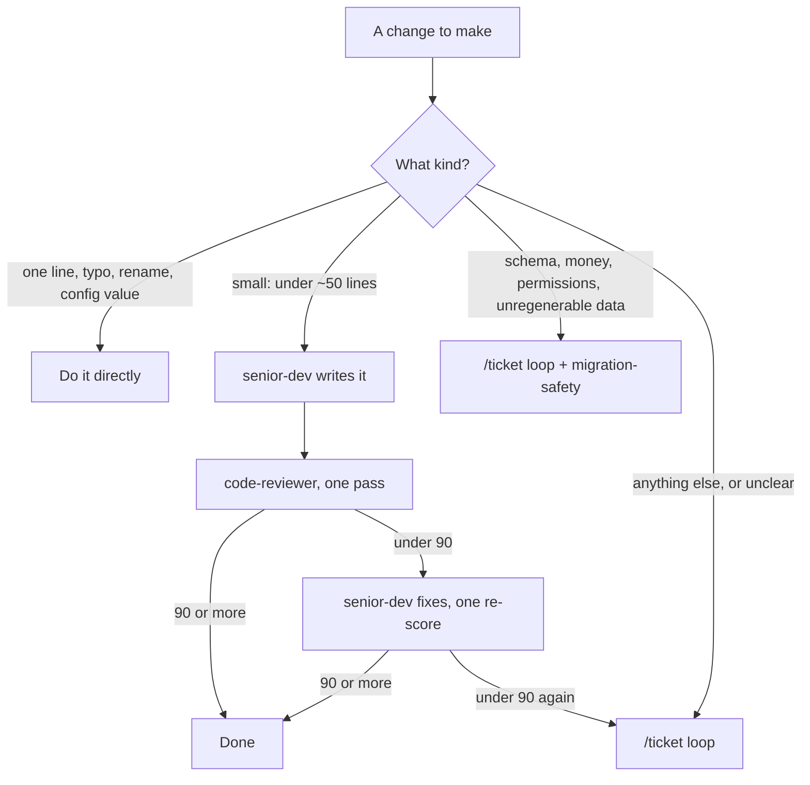
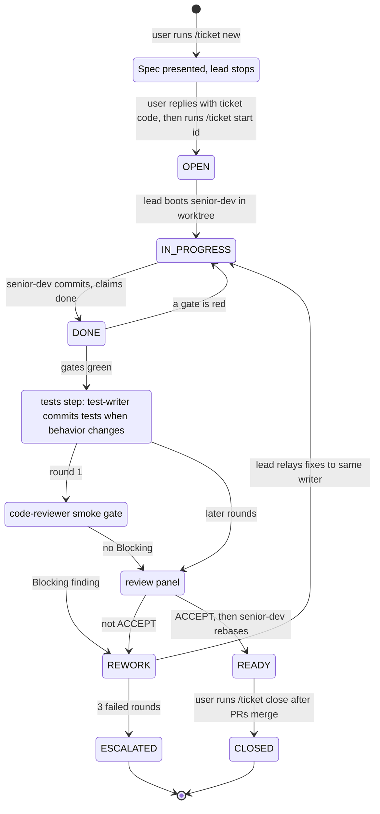

# How it works

This page explains the Claude Code agent workflow in this repo: what each piece
does, what depends on what, and which decisions hold it together. It is for a
reader who wants to understand the setup or borrow ideas from it. It is not an
install guide, and nothing here is supported for use on someone else's machine.

## What the workflow is for

Claude Code can hand work to subagents - separate agents with their own prompt
and tool list. This repo defines a team of them and one set of rules they all
follow. The aim is that code is written by one agent and judged by another that
cannot edit it, that nothing is called done without a score of 90 or more from
a reviewer, and that every claim in a report was checked in the session that
makes it. The rules live in plain markdown, and a few shell hooks enforce the
ones a prompt alone does not hold. Terms such as Blocking, ACCEPT and gates
are defined under [Terms](#terms).

### Who drives

One session, the lead, conducts every agent: it is the Claude Code session
the user talks to. The lead spawns each subagent, reads its report, and
decides what goes to whom next. Agents do not hand work to each other; a
reviewer's findings reach the writer because the lead relays them, and a
`researcher` answer reaches the writer the same way. In `/ticket` the lead
also owns every status change except one: the writer moves its own ticket
from IN_PROGRESS to DONE.

## The pieces

Everything sits under `home/` in this repo and reaches `~/.claude/` through
`home.nix`. Each entry below is a symlink, so an edit in the repo is live
without a rebuild, except `settings.base.json`, which is merged rather than
linked.

| In this repo | Lands at | What it is |
| --- | --- | --- |
| `home/AGENTS.md` | `~/.claude/CLAUDE.md`, `~/.codex/AGENTS.md`, `~/.config/opencode/AGENTS.md` | The global rules: guardrails, house rules, routing, git |
| `home/.claude/agents/` | `~/.claude/agents/` (one link for the directory) | The subagents, one file each |
| `home/.claude/commands/` | `~/.claude/commands/` (one link for the directory) | `/ticket`, `/comment-audit`, `/context-audit` |
| `home/.claude/skills/<name>/` | `~/.claude/skills/<name>/` (one link per skill) | `draft-ticket`, `primereact-v10`, `ship-pack`, `tailwind-v4` |
| `home/.claude/*.sh` | `~/.claude/*.sh` (one link per script) | Hooks, status line, session naming, the context audit |
| `home/.claude/settings.base.json` | merged into `~/.claude/settings.json` | Hook registrations, status line, two flags |

### How the rules reach every agent

`~/.claude/CLAUDE.md` is the user-level instruction file Claude Code loads into
every session, and `home.nix` links it to `home/AGENTS.md`. The root
[`AGENTS.md`](../AGENTS.md) states that this file also loads into every custom
subagent, which is why no agent file repeats the rules. The built-in `Explore`
and `Plan` agents do not see it, and
[`home/AGENTS.md`](../home/AGENTS.md#say-what-you-verified-and-nothing-more)
says to treat their output as leads to check.

### Why the reviewers cannot write

These agents carry `disallowedTools: Write, Edit, NotebookEdit` in their
frontmatter: `architect`, `code-reviewer`, `comment-auditor`, `doc-auditor`,
`fresh-eyes`, `migration-safety`, `researcher`, `review-triage`, `ui-verifier`.
`git-workflow` gets an allowlist instead (`Bash, Read, Grep, Glob`). The
writers are `senior-dev`, `test-writer`, `debugger` and `docs-writer`.

The reason is in [`home/AGENTS.md`](../home/AGENTS.md#subagents): fixes go back
to the agent that writes, never to the reviewer, so a reviewer never grades its
own fix. The agent files also leave out the `memory` frontmatter field, because
turning it on also turns Read, Write and Edit back on and would break that
boundary without any error ([`AGENTS.md`](../AGENTS.md)).

Each agent's `model:` frontmatter sets the model it runs on, and the
[agent table in the README](../README.md#agents) lists them. `inherit` means
the lead's model.

### Hooks act only once registered

A script in `~/.claude/` does nothing on its own. Claude Code runs it only when
`settings.json` names it, and `settings.base.json` is where these are named.
The two tool hooks each have a 5-second timeout. Only the `PostToolUse` one
starts with `[ ! -x <script> ] ||`, so a missing `comment-audit.sh` is skipped
quietly. `guard-bash.sh` has no such check on purpose: if it goes missing,
every Bash call shows a hook error instead of the commit protections switching
off without a word. The `SessionStart` and `statusLine` entries call
`~/.claude/session-name.sh --hook` and `~/.claude/statusline.sh` directly, with
no existence check and no `timeout` field.

| Event | Runs | Effect |
| --- | --- | --- |
| `PreToolUse` on `Bash` | `guard-bash.sh` | Blocks the command (exit 2) and tells the model why. Covers `git add .`, `-A`, `--all` and `:/`; a force push; `git clean -x`; and a commit message that credits an AI, has a subject over 72 characters, a body over 3 lines or 2 bullets, or a line about the session rather than the code |
| `PostToolUse` on `Write`, `Edit`, `MultiEdit` | `comment-audit.sh` | Nudges after the write (exit 2, which cannot undo it). In code files only, flags comments that tell history ("used to", "previously", dates), refer to the session ("as requested", "per the review"), or run past 2 lines |
| `SessionStart` | `session-name.sh --hook` | Names the session after its repo |
| `statusLine` | `statusline.sh` | Shows the model, context used, and rate-limit use |

`context-audit.sh` is not a hook. `/context-audit` runs it on demand to check
context files against size caps, and trims only files the user approves.

Hooks also fire inside subagents, which is where most code is written. That is
why the `/ticket` review round has no comment reviewer: the hook already checks
the writer's edits.

### What `/ticket` uses

`/ticket` ([`ticket.md`](../home/.claude/commands/ticket.md)) is the loop for
any change bigger than a small one. It never pushes, merges, or deletes a
branch; the finished branch is what it hands over.

The user runs it in two separate commands. `/ticket new <task>` writes the
spec, presents it, and stops. The user files the spec in Shortcut and replies
with the ticket code, which is the approval. Building starts only when the
user then runs `/ticket start <id>`.

| Step | Who runs it | Uses | Commits to the ticket branch |
| --- | --- | --- | --- |
| `new` - write the spec | User, then the lead | `draft-ticket` skill; `researcher` or `architect` when the design is open | Nothing; there is no branch yet |
| `start` - build | User, then the lead | `senior-dev` (the resident writer), booted on `opus` in a git worktree under `.tickets/<id>/tree/` | `senior-dev`, as it goes |
| Before review, when it applies | The lead | `impeccable` skill for design options (installed separately); `test-writer` when behavior changes | `test-writer` commits the tests it writes |
| Review round | The lead | `code-reviewer` every round; `migration-safety` for any migration; `ui-verifier` for frontend; `debugger` and `docs-writer` when triggered | `debugger` and `docs-writer`, when they run; the reviewers cannot write |
| Rework | The lead relays findings | The same resident writer | `senior-dev` commits each fix |
| Handover | The lead | `senior-dev` rebases in its worktree; `ship-pack` skill, once every ticket in the batch is READY | No new commits. `senior-dev` rebases the branch; folding its commits into one waits for the user's word |

Inside the loop, every writing agent commits its own work to the ticket
branch ([Git workflow](../home/AGENTS.md#git-workflow)). Outside it,
committing stays the user's call.

### Why skills are linked one at a time

`~/.claude/skills/` also holds third-party skills installed by hand with
`npx skills add`. Linking the whole directory from this repo would hide them,
so `home.nix` links each skill as its own entry, and `test.sh` reads those
lines to check the links. Commands and agents link as whole directories, since
this repo owns everything in them.

## Portable, Nix-specific, or taste

| Part | Kind | Without Nix |
| --- | --- | --- |
| `home/AGENTS.md`, agents, commands, skills | Portable | Plain markdown; Claude Code reads them from `~/.claude/` |
| Hook and status-line scripts | Portable | Bash plus `jq`; they act only once listed in `settings.json` |
| The settings merge | Nix-specific mechanism | The idea carries: keep durable keys in a file you merge in with `jq -s '.[0] * .[1]'`, and do not link `settings.json` |
| Links into `$HOME` (`mkOutOfStoreSymlink`) | Nix-specific | Plain symlinks do the same job |
| Per-username flake records, `users.sh`, `bootstrap.sh`, `rebuild.sh` | Nix-specific | Nothing to borrow outside Nix |
| Casks and brews in `configuration.nix`, packages and shell in `home.nix`, WezTerm, yt-dlp | Personal taste | Not part of the workflow |
| Shortcut ticket codes in `/ticket` and `draft-ticket`; the PrimeReact and Tailwind skills | Personal taste | Tied to the owner's tracker and front-end stack |

## Decisions that hold it together

Each row links to where the rule is stated. The one-line reasons here are
summaries; the linked text is the source.

| Decision | Why | Stated in |
| --- | --- | --- |
| Nothing ships under 90, and the score is the lowest finding, not an average | A user meets the worst part, so one Blocking finding caps the score | [Nothing ships under 90](../home/AGENTS.md#nothing-ships-under-90) |
| Only a correctness, requirements, or standards defect can block | A reviewer told to find gaps always finds some; chasing the rest over-engineers | [Nothing ships under 90](../home/AGENTS.md#nothing-ships-under-90) |
| Every report ends with a ledger of verified vs taken on trust | The caller knows what it can pass on without redoing the work | [Say what you verified](../home/AGENTS.md#say-what-you-verified-and-nothing-more) |
| Work is routed by size | Ceremony that does not change the outcome costs time and money | [How much of the chain to run](../home/AGENTS.md#how-much-of-the-chain-to-run) |
| Committing is the user's call; no AI in commit metadata | The author is the user; `guard-bash.sh` enforces it | [Git workflow](../home/AGENTS.md#git-workflow) |
| A comment says why, never when or who | Git already holds the history; a second copy goes stale | [A comment says why](../home/AGENTS.md#a-comment-says-why-never-when-or-who) |
| `~/.claude/settings.json` is merged, not linked | `/config`, `/model` and `/effort` write to it, and a link would put those writes in the repo | [Root AGENTS.md](../AGENTS.md) |
| Skills link one per entry | A directory link would hide the hand-installed skills | [Root AGENTS.md](../AGENTS.md) |
| Agents omit `memory` and `skills` frontmatter | `memory` turns write tools back on; a preloaded skill may not exist on a fresh machine | [Root AGENTS.md](../AGENTS.md) |
| Agent prompts name no stack | They load in every project, so they discover its tools instead | [Root AGENTS.md](../AGENTS.md) |

## Routing work by size

From [How much of the chain to run](../home/AGENTS.md#how-much-of-the-chain-to-run).
When it is unclear which applies, it is a ticket.

## The `/ticket` loop

Upper-case names are the statuses kept in the ticket file. The lower-case
boxes are steps, not statuses: "Spec presented" comes before the ticket file
exists, and the tests step and both review boxes run while the status is
still DONE. An arrow whose label starts with "user" or "senior-dev" is
that party's move; every other arrow is the lead acting.

ACCEPT means every score is 90 or more and no finding anywhere is Blocking. The
3-round limit counts rounds on one spec version; a scope change by the user
starts the count again.

## A worked example

A change to the `draft-ticket` skill in this repo, made as four commits:

| Commit | Subject | Files |
| --- | --- | --- |
| `b2367d9` | feat(claude): keep a label record for draft-ticket to reuse | `draft-ticket/SKILL.md` |
| `4bb421e` | feat(claude): make acceptance criteria the floor of a ticket's tests | `code-reviewer.md`, `test-writer.md`, `ticket.md`, `draft-ticket/SKILL.md` |
| `70d7f5b` | feat(claude): give draft-ticket titles a voice per ticket type | `draft-ticket/SKILL.md` |
| `3e95851` | feat(claude): replace the user-story sentence with a Why section | `draft-ticket/SKILL.md`, `draft-ticket/references/standards.md` |

`git show --stat <commit>` shows each one. The review scores below are not
recorded in git.

1. `researcher` gathered evidence on how engineers write tickets.
2. `senior-dev` wrote the prompt edits.
3. `code-reviewer` scored 80, with two Blocking findings: an example title
   longer than the skill's own 80-character limit, and a label file named after
   Shortcut in a skill that also covers Jira.
4. `senior-dev` fixed both. The label record is `.claude/ticket-labels.md`.
5. `code-reviewer` scored 95.
6. The work was committed as four commits, one theme each.

Both findings were the skill breaking its own rules, and both were caught by a
reviewer that had not written the change and could not edit it. One fix and
one re-score is what a small change gets before it escalates to a ticket.

## Terms

| Term | Meaning | Source |
| --- | --- | --- |
| Lead | The Claude Code session the user talks to. It spawns every agent and relays between them | [`ticket.md`](../home/.claude/commands/ticket.md) |
| Score | A number out of 100 that `code-reviewer`, `ui-verifier` or `migration-safety` gives a change. It is the floor of what was found, never an average | [Nothing ships under 90](../home/AGENTS.md#nothing-ships-under-90) |
| Gated at 90, the 90 gate | Work passes review only with a score of 90 or more. Under 90 means the same as REQUEST CHANGES or FAIL | [Nothing ships under 90](../home/AGENTS.md#nothing-ships-under-90) |
| Blocking | A finding that names a correctness defect, a requirements miss, or a breach of the standard the reviewer applies. One Blocking finding caps the score under 90 | [Nothing ships under 90](../home/AGENTS.md#nothing-ships-under-90), [`code-reviewer.md`](../home/.claude/agents/code-reviewer.md) |
| Should-fix | A real problem below Blocking. In `/ticket` it goes to the writer with the Blocking findings, unless its fix would add a new mechanism, such as a retry or a new dependency; then the user decides first | [`ticket.md`](../home/.claude/commands/ticket.md) step 4 |
| APPROVE, REQUEST CHANGES | The verdict line of `code-reviewer` and `migration-safety`. `ui-verifier` says PASS or FAIL instead | The agent files' Output sections |
| ACCEPT | The lead's verdict on a whole `/ticket` round: APPROVE with every score at 90 or more and no Blocking finding anywhere. Anything else sends the ticket to REWORK | [`ticket.md`](../home/.claude/commands/ticket.md) step 4 |
| Gates | The repo's own tests, lint and build, run green in the worktree with the output shown. A DONE claim without them goes back to the writer before any reviewer starts | [`ticket.md`](../home/.claude/commands/ticket.md) step 3 |
| Smoke gate | Round 1 of review starts with `code-reviewer` alone. A Blocking finding sends the ticket to REWORK before the rest of the panel runs | [`ticket.md`](../home/.claude/commands/ticket.md) step 3 |
| Round | One pass of review. The count rises only when the writer is sent work, and 3 failed rounds on one spec version end in ESCALATED | [`ticket.md`](../home/.claude/commands/ticket.md) step 4 |
| Ticket code | The Shortcut story ID, such as `sc-1234`, that the user replies with after filing the spec. The reply is the approval, and the code becomes the start of the ticket id and the commit scope | [`ticket.md`](../home/.claude/commands/ticket.md) |
| Resident writer | The `senior-dev` that `/ticket start` boots in the ticket's worktree. It stays running across rework rounds, receives every fix, and commits to the ticket branch. Other writers in the worktree work one at a time while it idles | [`ticket.md`](../home/.claude/commands/ticket.md), [`senior-dev.md`](../home/.claude/agents/senior-dev.md) |
| Batch | Several tickets approved together. The lead fixes their order, a ticket that builds on another branches from it, and `ship-pack` hands them over once all are READY | [`ticket.md`](../home/.claude/commands/ticket.md) steps 2 and 5 |
