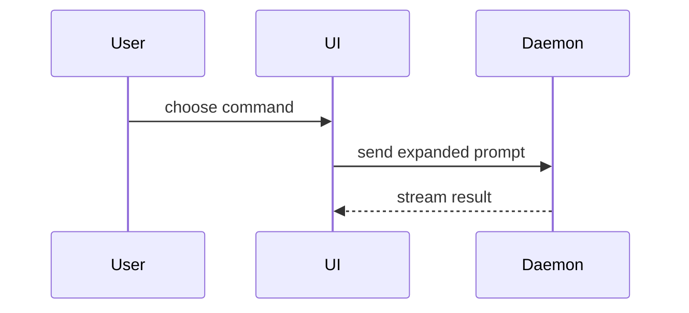

Produce the two things a pull request description needs, a title and a body, and nothing else. The user opens the PR; this skill only writes its text.

Where this skill names a `docs/agents/` file, read it from the package that holds the changed files, else from the repo root.

Before writing, read the subjects of the PR's commits (`git log --format=%s <base>..HEAD`). When they hold more than one theme, such as a feature beside a refactor, tell the user it could be split, then title the main theme.

The title is one Conventional Commits line in the imperative, at most 72 characters, naming the PR's one theme and ending with the ticket ID in brackets, e.g. `feat: time out a hung SSO refresh [sc-10510]`.

Find the ticket ID (Shortcut `sc-1234`, or Jira `KEY-123` per the tracker file) in the branch name, a `Tracker:` line in the ticket file, or the commit messages; when none has it, ask the user. The body's first line names it: `Shortcut: sc-1234` or `Jira: KEY-123`, a link when the tracker URL is known.

Use this template for the body:

```markdown
## Summary

<diagram, diff-sketch, or tree>

## Evidence

- **Before:** <screenshot/output/failing test run>
  **After:** <screenshot/output/passing test run>

## Merge Danger

**Door:** <one-way or two-way>

<optional: description>

**Blast Radius:** <one-word description>

<optional: potential ramifications of merge>
```

## Sections

Skip all preambles and keep prose brief. Use the user's domain language from the glossary at the path `docs/agents/domain.md` names, else `GLOSSARY.md`.

### Summary

Pick the smallest view that makes the key point clear.

- Show logic or an algorithm as pseudocode:

```text
on(save)
  if content is unchanged
    return cached result
  write new content
  return fresh result
```

- Show runtime control flow as a call tree:

```text
submitForm
  createSession
    persistPrompt
    launchAgent
  navigateToSession
```

- Show UI structure as a component tree, including state and module boundaries that matter:

```text
<SessionPage> (apps/example/src/routes/session.tsx)
  useSessionEvents()
  <SessionToolbar>
    <RunSkillButton> (packages/ui)
```

- Show file responsibility or a broad refactor as a shallow file tree:

```text
src/
├── commands/       # parses user actions
├── sessions/       # owns session state
└── transport/      # sends API requests
```

- Show component interaction, control flow, or data flow with Mermaid:



- Use `diff` when the point is what changes and the surrounding shape already exists. Match the diff shape to the topic.

For a component change:

```diff
 <SessionPage>
   useSessionEvents()
   <SessionToolbar>
+    <RunSkillButton />
   <SessionTimeline>
+    <SkillResultCard />
```

For a file-layout change:

```diff
 src/
 ├── commands/
+│   └── show-me.ts       # expands the slash command
 ├── sessions/
-└── transport.ts
+└── transport/
+    ├── client.ts
+    └── stream.ts
```

For a call-tree or call-stack change:

```diff
 submitForm
   createSession
     persistPrompt
+    expandSkillMention
     launchAgent
-  navigateToSession
+  navigateToSession
+    subscribeToEvents
```

For a state or control-flow change:

```diff
 on(save)
-  write content
+  if content is unchanged
+    return cached result
+  write new content
+  invalidate cache
```

- Show the whole block when most of it is new, when omitted context would hide ownership or order, or when the user needs a copyable target shape:

```ts
function expandSkill(command: string): string {
  const skillName = command.slice(1);
  return `use the ${skillName} skill`;
}
```

#### Guidance

Place each visual next to the short text it supports. Keep only the calls, files, props, states, and boundaries needed to answer the user's current question or the options to resolve the current discussion point.

You may use one of these, you may use several, it is unlikely you will use all of them. Use your judgement and don't overwhelm the user.

### Evidence

Concrete evidence that the change works. Show a before and after.

Screenshots are S-tier - when the environment is set up for it and the change is visual.

Execution-based evidence is A-tier. Test results, console output. Show the exact test that now fails and passes, using pseudocode.

Take test evidence from runs already in this session (the `tdd` red and green runs, the implement reports) or from CI. Don't run the suite. With no results in hand, name the test in pseudocode and say it was not run here.

When one command shows the before without switching branches, run it against the old code from `git show <base>:<path>`; otherwise label the evidence "after only".

### Merge Danger

Describe whether it's a one-way or two-way door. You can walk back through two-way doors, but not one-way doors. A PR that is cheap to roll back is lower risk. Changes that involve destructive actions or hard-to-reverse decisions are one-way doors.

The blast radius is the potential impact or scope of the changes introduced by this PR. Consider all possibilities. Examples are layout shift, breakages for consumers, mobile responsiveness, etc.

## Screenshots

When the change is visual and the app runs, capture before and after screenshots, desktop and mobile (Chrome device emulation through `chrome-devtools-axi`), into a temp folder outside the repo. Name each for its spot (`before-desktop.png`, `after-mobile.png`), and in the body's Evidence section put a marker where each belongs: `<!-- drag after-mobile.png here -->`. GitHub only shows images uploaded through its editor, so the user drags each file onto its marker when opening the PR. A change with nothing to see carries its evidence as test output in the body instead.

## Authorship

Before publishing, prove no AI is credited. Save the body to a temp file and, from the repo, run this skill's `scripts/provenance.sh <base> --body <file>`, where `<base>` is `git merge-base origin/main HEAD` after a `git fetch`. Run it; its rules live in `guard-bash.sh`, so there is nothing to read. It checks the author, committer, and message of every commit in the PR, and the body, for any agent, model, or bot.

Run it on the final body, and again after any edit to the body. On the page, show `<base>` as the literal commit ID.

- Exit 0, `CLEAN`: put the command and its raw output on the page as the proof.
- Exit 1, `FLAGGED`: publish nothing. Tell the user which commit or the body, and why, as printed.
- Exit 2, `UNVERIFIED`: publish nothing. Tell the user what it could not check.

## Output

Publish one page with the harness's page-publishing tool (in Claude Code, the Artifact tool), or write a local HTML file when there is none. It holds the title, then the body markdown, each with a Copy button that copies its raw text, then each screenshot shown under its file name with its full local path and a Copy button for that path (published pages block downloads, so the user drags the file from that folder), then the authorship proof. In the reply, give only the page link and the authorship verdict. Pushing, opening, and merging the PR stay with the user.
